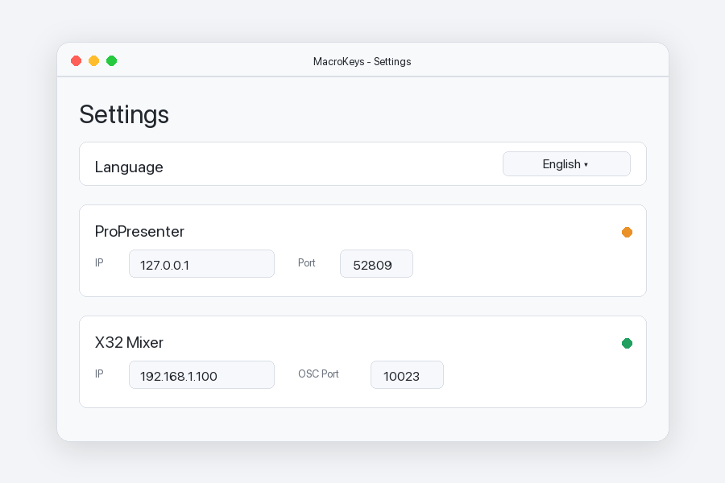

# MacroKeys


MacroKeys is a small macOS menu bar app for triggering configurable keyboard shortcuts. Each shortcut can run one or more actions for ProPresenter and Behringer X32 mixers, such as changing slides, starting capture, adjusting faders, muting channels, or sending OSC commands.

The app stores its configuration locally in the user's Application Support folder. The interface supports German and English; the language can be changed in the settings window and translations live in `Resources/Localization`.

## Hardware

MacroKeys is currently written for this style of 6-key USB macro pad:


## Screenshots




## Build

Open `MacroKeys.xcodeproj` in Xcode or build from the command line:

```bash
xcodebuild -project MacroKeys.xcodeproj -scheme MacroKeys -configuration Debug build
```

## Notes

MacroKeys is intended for trusted local networks. It sends commands to the configured ProPresenter and X32 hosts and does not include credentials or remote cloud services.

## License

MacroKeys is source-available under the PolyForm Noncommercial License 1.0.0. Noncommercial use, modification, and redistribution are allowed; commercial use, resale, and paid redistribution are not permitted without separate permission. See `LICENSE` for details.
