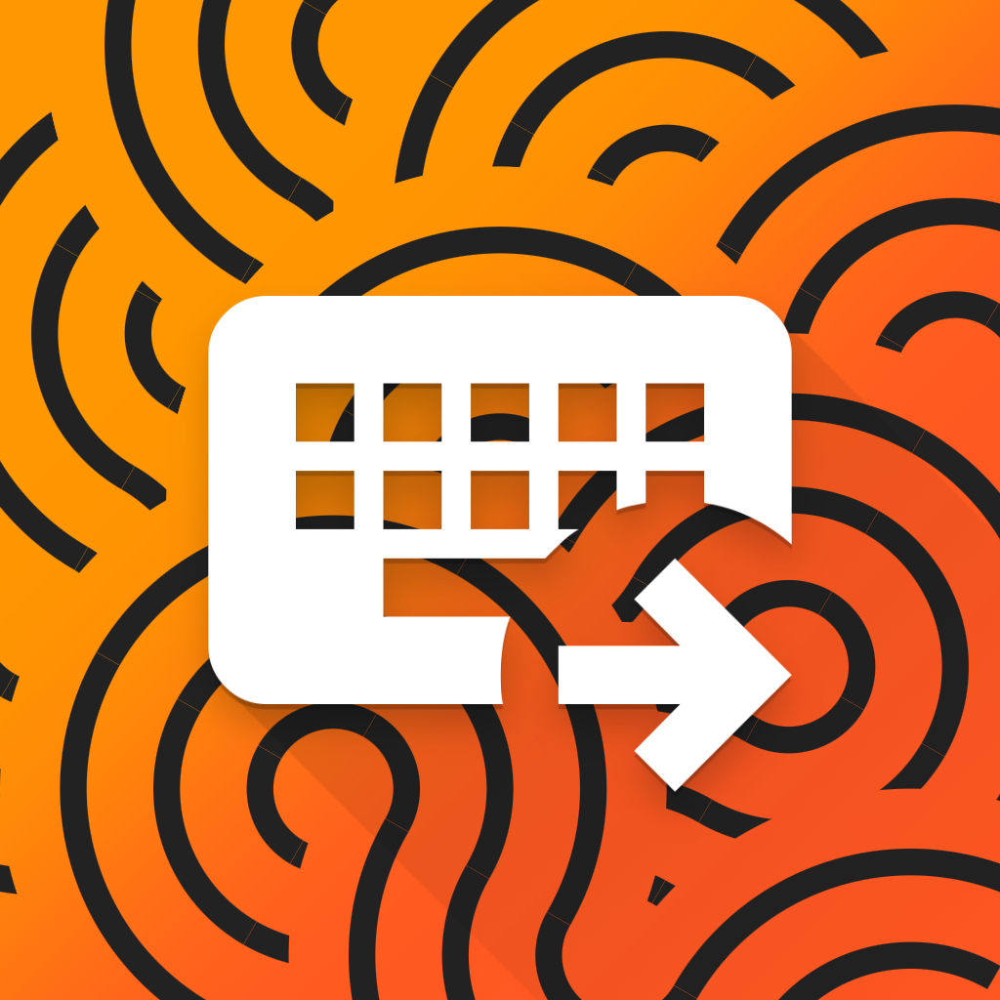
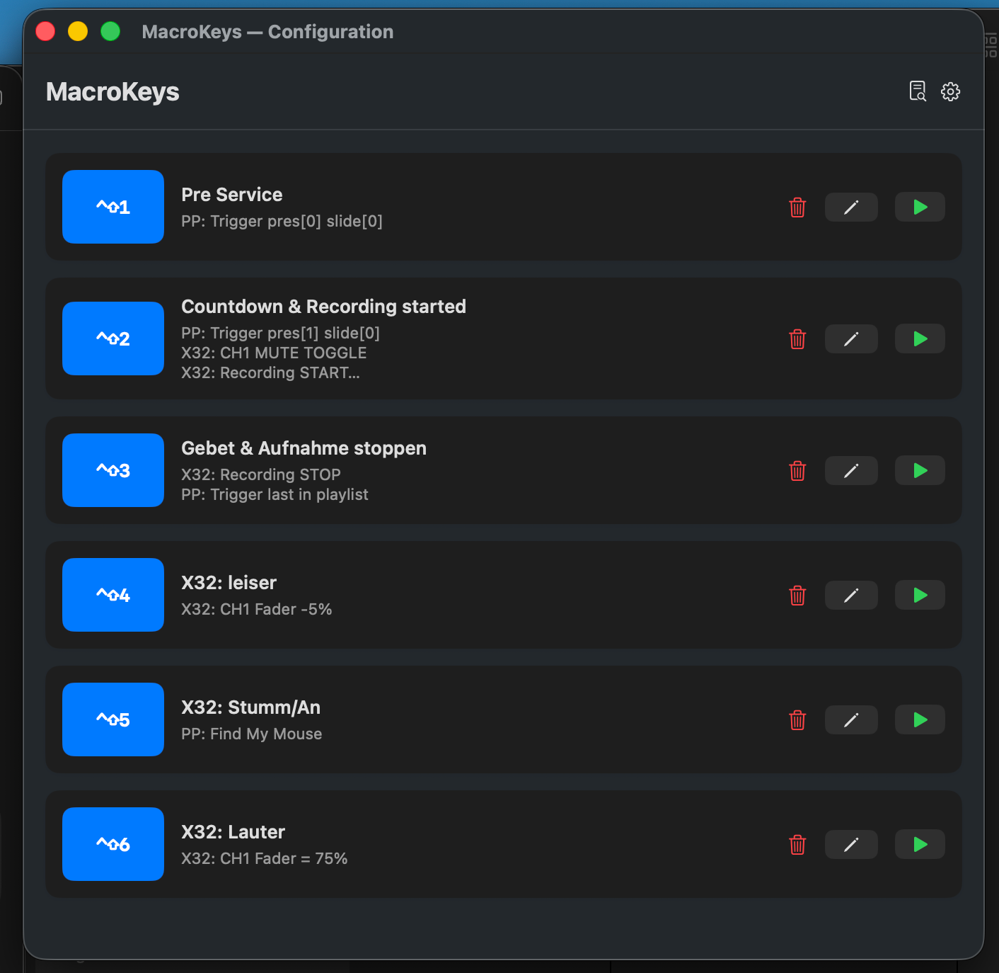
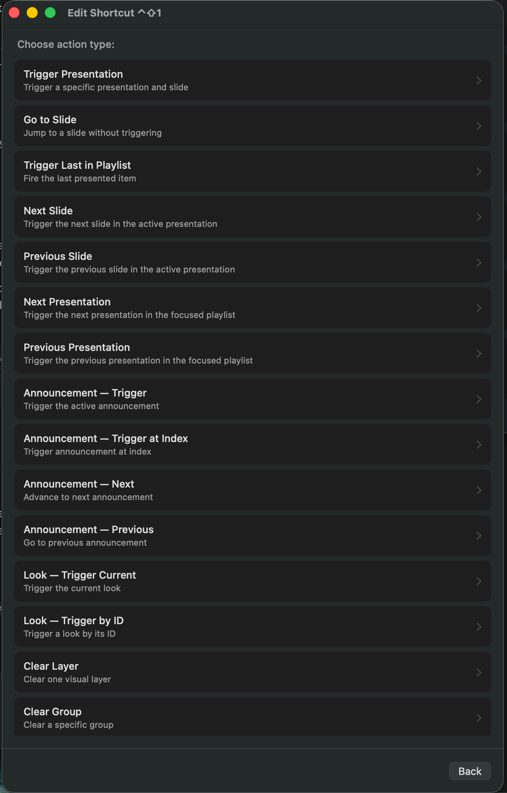
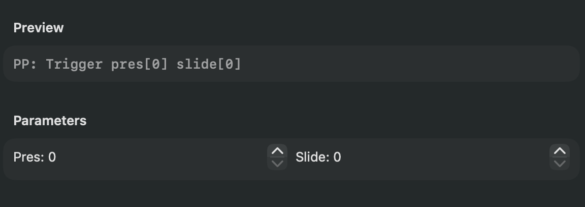
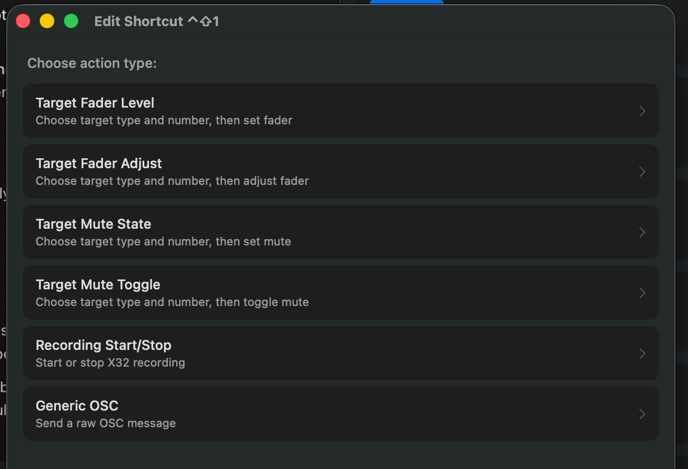

# MacroKeys



MacroKeys is a small macOS menu bar app for triggering configurable keyboard shortcuts. Each shortcut can run one or more actions for ProPresenter, Behringer X32 mixers, and Lightkey, such as changing slides, starting capture, adjusting faders, muting channels, triggering lighting cues, or sending OSC commands.

The app stores its configuration locally in the user's Application Support folder. The interface supports German and English; the language can be changed in the settings window and translations live in `Resources/Localization`.

## Hardware

MacroKeys was originally written for this style of 6-key USB macro pad. The number of active buttons can be changed in the settings window.


## Screenshots

<table>
  <tr>
    <td width="50%">
      
      <br>
      <strong>Shortcut configuration</strong>
    </td>
    <td width="50%">
      
      <br>
      <strong>ProPresenter actions</strong>
    </td>
  </tr>
  <tr>
    <td width="50%">
      
      <br>
      <strong>Action parameters</strong>
    </td>
    <td width="50%">
      
      <br>
      <strong>X32 actions</strong>
    </td>
  </tr>
</table>

## Actions

### ProPresenter

| Action | What it does |
| --- | --- |
| Trigger Presentation | Trigger a specific presentation and slide |
| Go to Slide | Jump to a slide without triggering |
| Trigger Last in Playlist | Fire the last presented item |
| Next Slide | Trigger the next slide in the active presentation |
| Previous Slide | Trigger the previous slide in the active presentation |
| Next Presentation | Trigger the next presentation in the focused playlist |
| Previous Presentation | Trigger the previous presentation in the focused playlist |
| Announcement - Trigger | Trigger the active announcement |
| Announcement - Trigger at Index | Trigger an announcement by index |
| Announcement - Next | Advance to the next announcement |
| Announcement - Previous | Go to the previous announcement |
| Look - Trigger Current | Trigger the current look |
| Look - Trigger by ID | Trigger a look by its ID |
| Clear Layer | Clear one visual layer |
| Clear Group | Clear a specific group |
| Clear All | Clear all layers |
| Transport - Play | Start playback |
| Transport - Pause | Pause playback |
| Transport - Stop | Stop playback |
| Transport - Play/Pause | Toggle play/pause |
| Stage Display - On | Enable stage display |
| Stage Display - Off | Disable stage display |
| Stage Display - Toggle | Toggle stage display |
| Audio - Trigger Playlist | Trigger an audio playlist |
| Audio - Next | Trigger the next track |
| Audio - Previous | Trigger the previous track |
| Audio - Stop | Stop audio playback |
| Capture - Start | Start screen capture |
| Capture - Stop | Stop capture |
| Group - Trigger | Trigger a global group |
| Operation - Trigger | Run a named operation |
| Find My Mouse | Highlight the mouse pointer |

### X32 Mixer

| Action | What it does |
| --- | --- |
| Target Fader Level | Choose a target type and number, then set its fader |
| Target Fader Adjust | Choose a target type and number, then adjust its fader |
| Target Mute State | Choose a target type and number, then set mute |
| Target Mute Toggle | Choose a target type and number, then toggle mute |
| Recording Start/Stop | Start or stop X32 recording |
| Generic OSC | Send a raw OSC message |

### Lightkey

| Action | What it does |
| --- | --- |
| Cue - Toggle | Toggle a Lightkey cue via OSC |
| Cue - Activate | Activate a Lightkey cue via OSC |
| Cue - Deactivate | Deactivate a Lightkey cue via OSC |
| Generic OSC | Send a raw Lightkey OSC message |

## Build

Open `MacroKeys.xcodeproj` in Xcode or build from the command line:

```bash
xcodebuild -project MacroKeys.xcodeproj -scheme MacroKeys -configuration Debug build
```

## Notes

MacroKeys is intended for trusted local networks. It sends commands to the configured ProPresenter, X32, and Lightkey hosts and does not include credentials or remote cloud services.

## License

MacroKeys is source-available under the PolyForm Noncommercial License 1.0.0. Noncommercial use, modification, and redistribution are allowed; commercial use, resale, and paid redistribution are not permitted without separate permission. See `LICENSE` for details.
